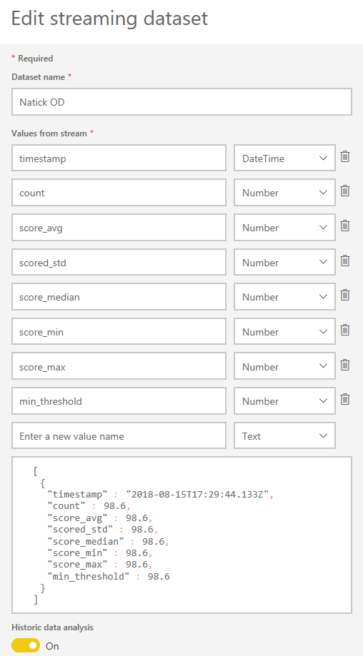

# README
*Last updated August 15, 2018*

## How to Run
Clone this repo into a directory of your choice, and make sure you have the following installed:

### Dependencies
- `pip install cython`
- `pip install pillow`
- `pip install lxml`
- `pip install matplotlib`
- `pip install imutils`
- `pip install opencv-python`
- `pip install --ignore-installed --upgrade tensorflow`

### Creating a Power BI Streaming Dataset
Create a Power BI streaming dataset following [this tutorial](https://docs.microsoft.com/en-us/power-bi/service-real-time-streaming). When creating your dataset, add the following values.

### Running the Code
Then edit line 139 of `natick_OD.py` to use your Power BI Push URL. Finally, navigate to where you cloned the repo and run `python natick_OD.py`

## Note
This repo uses code from the [TensorFlow Object Detection repository](https://github.com/tensorflow/models/tree/master/research/object_detection). We have edited the file `utils\visualization_utils.py` so that it displays the fish count in the bottom left corner of the video.

# Contributing

This project welcomes contributions and suggestions.  Most contributions require you to agree to a
Contributor License Agreement (CLA) declaring that you have the right to, and actually do, grant us
the rights to use your contribution. For details, visit https://cla.microsoft.com.

When you submit a pull request, a CLA-bot will automatically determine whether you need to provide
a CLA and decorate the PR appropriately (e.g., label, comment). Simply follow the instructions
provided by the bot. You will only need to do this once across all repos using our CLA.

This project has adopted the [Microsoft Open Source Code of Conduct](https://opensource.microsoft.com/codeofconduct/).
For more information see the [Code of Conduct FAQ](https://opensource.microsoft.com/codeofconduct/faq/) or
contact [opencode@microsoft.com](mailto:opencode@microsoft.com) with any additional questions or comments.
